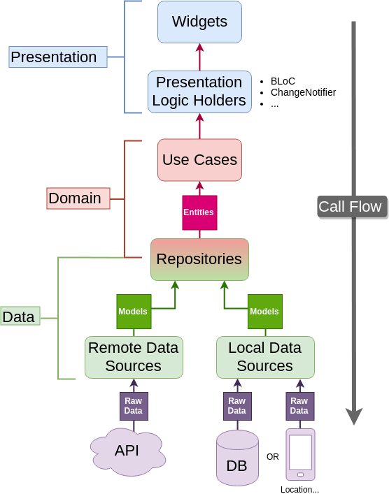

# timepomodoro_app
TimePomodoro is an application that applies this technique to improve productivity.

## Getting Started

#Run Project
Console
1. flutter pub get
2. flutter gen-l10n

Note: If your device or emulator is configured in Spanish, the app texts will appear in Spanish, the same for the English language.

This project was created using the clean architecture and the Bloc pattern.

1. Clean Architecture:

- Concept: Clean Architecture is a set of principles and software design practices aimed at creating maintainable and scalable systems. It advocates for the separation of concerns and the organization of code into layers, each with its specific responsibility.

- Core Layers:
    - Entities: Represent fundamental business concepts.
    - Use Cases: Contain business logic and coordinate interaction between entities.
    - User Interface Adapters (UI): Manage user interaction.
    - Frameworks and Drivers: Contain technical details and specific frameworks.

2. Bloc Pattern:

- Concept: Bloc stands for Business Logic Components. It's a software design pattern commonly used in Flutter app development to manage data flow and business logic.

- Structure:
    - Events: Actions that trigger a change in state.
    - States: Represent the user interface state at a given moment.
    - Bloc: Manages the application state in response to events and contains business logic.
    - Unidirectional Data Flow: Information flows from events through the Bloc to states, maintaining a predictable unidirectional data flow.

In summary, Clean Architecture aims for modular and decoupled design to facilitate software maintenance and evolution. On the other hand, the Bloc pattern focuses on state management and business logic in Flutter applications, providing a clear structure and a predictable unidirectional data flow.

